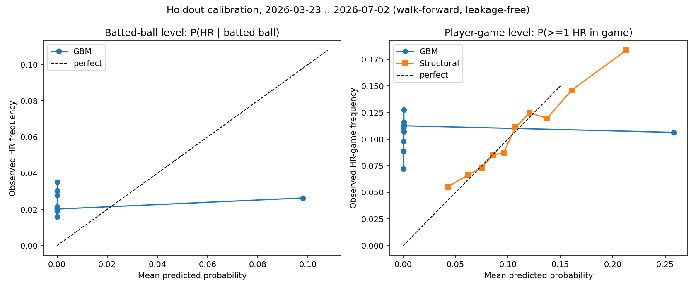

# Model Evaluation — Honest Holdout Results

Strict time-based holdout: trained on **2025-03-27 → 2026-03-22**, tested on
**2026-03-23 → 2026-07-02** (three walk-forward segments). Rolling features were
rebuilt as-of each test date; the season-level `p_xera_gap` component of
`p_hr_vulnerability_score` was **excluded** because season aggregates would leak
future games. Market comparison uses a one-sided de-vig assumption (6% margin)
on the 88 tracked picks that fall inside the test window.

## Headline results (player-game level, n = 27,258, 2,869 HRs)

| Model | AUC | Brier ↓ | Log loss ↓ | Mean pred | Actual rate |
|---|---|---|---|---|---|
| **Structural formula** | **0.612** | **0.0929** | **0.330** | 0.110 | 0.105 |
| Base rate (always 10.5%) | 0.474 | 0.0942 | 0.337 | 0.105 | 0.105 |
| GBM (`hr_model.pkl`) | 0.533 | 0.1181 | 0.833 | 0.026 | 0.105 |

## On the 88 tracked betting picks (14 homered)

| Predictor | AUC | Brier ↓ | Log loss ↓ |
|---|---|---|---|
| **Market implied (de-vig)** | **0.633** | **0.1316** | **0.425** |
| Base rate | 0.500 | 0.1366 | 0.451 |
| Structural formula | 0.493 | 0.1405 | 0.454 |
| GBM | 0.372 | 0.2502 | 1.587 |

## What this means — plainly

1. **The GBM is broken.** On held-out data it is *worse than useless*: at the
   batted-ball level its AUC is 0.456 (below a coin flip) and it predicts a
   0.95% HR rate where the true rate is 2.39%. At the player-game level its
   Brier score is worse than just predicting the league base rate for
   everyone. On the actual tracked picks it is the worst predictor measured.
   Its live losses were not bad luck.
2. **The simple structural formula beats the 85-feature GBM on every metric.**
   `P(HR) = 1 − (1 − p_PA)^E[PA]` with empirical-Bayes shrinkage of batter and
   pitcher rates toward league means — no machine learning, every constant
   documented in `structural_model.py` — is the best model this project has.
3. **Nobody here beats the market.** The de-vigged book price out-predicts all
   of our models on the picks subset. Until a model beats the market's Brier
   score on held-out picks, no betting edge exists. (Caveat: n = 88 is small;
   this comparison needs hundreds more tracked picks to be conclusive.)



## Next steps, ranked by expected value

1. **Retire the current GBM.** If ML is retained, retrain at the player-game
   level on a time-based split with proper calibration — the current model's
   miscalibration (predicting 2.6% where reality is 10.5%) suggests its
   training distribution never matched the deployment question.
2. **Improve the structural model's `E[PA]`** with lineup-slot data (leadoff
   ≈ 4.7 PA/game vs ninth ≈ 3.9) — a ~20% probability swing books are slow on.
3. **Add park HR factors by handedness and weather/air density** to `p_PA` —
   the highest-signal context features for home runs specifically.
4. **Line-shop across books** and only bet when the best available price beats
   the de-vig consensus — price selection can create positive CLV even with a
   market-matching model.
5. **Track CLV on every pick going forward** (closing price vs bet price), the
   fastest-converging measure of whether any of the above created real edge.

## Reproduce

```bash
python3 evaluate_model.py     # writes eval_results.json + calibration_curve.png
python3 -m unittest discover tests
```
