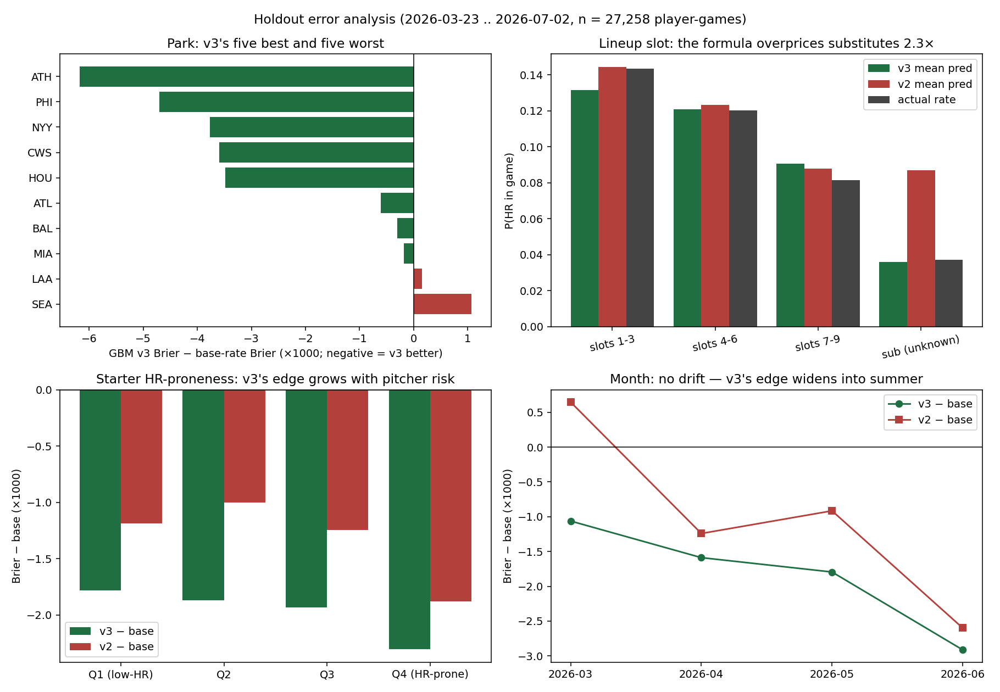

# Model Evaluation — Honest Holdout Results

> This document is an arc, kept in chronological order: the original GBM's
> failure, the structural formula that beat it, the v2 upgrades, and — at
> the end — **GBM v3, the retrained ML that now holds the best holdout
> score in the repo** and is running live under a pre-registered protocol
> ([PROTOCOL.json](PROTOCOL.json), scorecard in
> [SCOREBOARD.md](SCOREBOARD.md)).

Strict time-based holdout: trained on **2025-03-27 → 2026-03-22**, tested on
**2026-03-23 → 2026-07-02** (three walk-forward segments). Rolling features were
rebuilt as-of each test date; the season-level `p_xera_gap` component of
`p_hr_vulnerability_score` was **excluded** because season aggregates would leak
future games. Market comparison uses a one-sided de-vig assumption (6% margin)
on the 88 tracked picks that fall inside the test window.

## Headline results (player-game level, n = 27,258, 2,869 HRs)

| Model | AUC | Brier ↓ | Log loss ↓ | Mean pred | Actual rate |
|---|---|---|---|---|---|
| **Structural formula** | **0.612** | **0.0929** | **0.330** | 0.110 | 0.105 |
| Base rate (always 10.5%) | 0.474 | 0.0942 | 0.337 | 0.105 | 0.105 |
| GBM (`hr_model.pkl`) | 0.533 | 0.1181 | 0.833 | 0.026 | 0.105 |

## On the 88 tracked betting picks (14 homered)

| Predictor | AUC | Brier ↓ | Log loss ↓ |
|---|---|---|---|
| **Market implied (de-vig)** | **0.633** | **0.1316** | **0.425** |
| Base rate | 0.500 | 0.1366 | 0.451 |
| Structural formula | 0.493 | 0.1405 | 0.454 |
| GBM | 0.372 | 0.2502 | 1.587 |

## What this means — plainly

1. **The GBM is broken.** On held-out data it is *worse than useless*: at the
   batted-ball level its AUC is 0.456 (below a coin flip) and it predicts a
   0.95% HR rate where the true rate is 2.39%. At the player-game level its
   Brier score is worse than just predicting the league base rate for
   everyone. On the actual tracked picks it is the worst predictor measured.
   Its live losses were not bad luck.
2. **The simple structural formula beats the 85-feature GBM on every metric.**
   `P(HR) = 1 − (1 − p_PA)^E[PA]` with empirical-Bayes shrinkage of batter and
   pitcher rates toward league means — no machine learning, every constant
   documented in `structural_model.py` — is the best model this project has.
3. **Nobody here beats the market.** The de-vigged book price out-predicts all
   of our models on the picks subset. Until a model beats the market's Brier
   score on held-out picks, no betting edge exists. (Caveat: n = 88 is small;
   this comparison needs hundreds more tracked picks to be conclusive.)


## Next steps, ranked by expected value

1. **Retire the current GBM.** If ML is retained, retrain at the player-game
   level on a time-based split with proper calibration — the current model's
   miscalibration (predicting 2.6% where reality is 10.5%) suggests its
   training distribution never matched the deployment question.
2. **Improve the structural model's `E[PA]`** with lineup-slot data (leadoff
   ≈ 4.7 PA/game vs ninth ≈ 3.9) — a ~20% probability swing books are slow on.
3. **Add park HR factors by handedness and weather/air density** to `p_PA` —
   the highest-signal context features for home runs specifically.
4. **Line-shop across books** and only bet when the best available price beats
   the de-vig consensus — price selection can create positive CLV even with a
   market-matching model.
5. **Track CLV on every pick going forward** (closing price vs bet price), the
   fastest-converging measure of whether any of the above created real edge.

## v2 upgrades: lineup-slot E[PA] + park factors — ablation results

Two upgrades, both leakage-safe (constants computed from the training window
only): **(1)** E[PA] from the batter's inferred lineup slot that game (70%
league slot average + 30% trailing personal rate), **(2)** per-park HR/PA
factors split by batter handedness, shrunk toward 1.0 with 2,000 pseudo-PA and
clipped to [0.80, 1.25].

### Player-game level (n = 27,258)

| Variant | AUC | Brier ↓ | Log loss ↓ |
|---|---|---|---|
| v1 structural | 0.6124 | 0.09286 | 0.32961 |
| v1 + slots | 0.6169 | 0.09280 | 0.32909 |
| v1 + parks | 0.6131 | 0.09292 | 0.32970 |
| **v2 (slots + parks)** | **0.6173** | 0.09286 | 0.32920 |

### On the 88 tracked picks, vs the market

| Predictor | AUC | Brier ↓ |
|---|---|---|
| **Market implied (de-vig)** | **0.6327** | **0.13159** |
| v2 (slots + parks) | 0.5212 | 0.14097 |
| v1 structural | 0.4932 | 0.14053 |

### Betting simulation (flat 1u on Yes when v2 prob − de-vig market prob ≥ threshold)

| Threshold | Bets | Record | ROI |
|---|---|---|---|
| ≥1pp | 49 | 6–43 | **−40.1%** |
| ≥2pp | 41 | 4–37 | **−46.3%** |
| ≥3pp | 31 | 4–27 | **−29.0%** |
| ≥5pp | 14 | 0–14 | **−100%** |

*Caveat: n = 88 model-selected picks, not a random market sample — illustrative
only. The direction, however, is unambiguous.*

### Verdict — plainly

**The v2 upgrades did not close the gap to the market.** Slots and parks are
real effects and v2 is the best model in this repo (AUC 0.6124 → 0.6173), but
the market's Brier advantage barely moved — because books already price slots
and parks. The betting simulation shows the fatal pattern: the more the model
disagrees with the market, the worse it does. The model's perceived edge is
its own error, not the book's.

**Conclusion: no betting edge exists in this system as built.** The remaining
gap is day-of information (confirmed lineups, weather at first pitch, pitcher
velocity trends) and price selection across books — not more historical
feature engineering. This is a negative result, reached honestly, and the
methodology (leakage-safe walk-forward ablation against a market benchmark) is
the reusable part.

## GBM v3 — the ML rematch, done right

The original GBM's failure was never evidence that ML can't work here; it
was evidence that ML trained on the wrong question can't. v3 retrains at
the **player-game level** (one row per batter-game, label = homered y/n) on
the structural model's own inputs — shrunken batter rate, pitcher factor,
platoon factor, park factor, slot-aware E[PA], structural v2's log-odds —
**plus** the 85 profile features (barrel%, exit velo, pull-air, platoon
splits, recent form), all rebuilt leakage-safe as-of each date
(`use_season_stats=False`; the only exclusion is the season-level
`p_xera_gap` term, which cannot be made point-in-time). Training rows come
from walk-forward segments inside the training window; model selection and
isotonic-vs-sigmoid calibration use a **time-ordered validation slice**
(2025-09-15→12-01 + 2026-03) — no random CV across time anywhere. The
holdout is the identical 27,258 player-games. See `train_model_v3.py`.

### The verdict (player-game level, n = 27,258)

| Model | AUC | Brier ↓ | Log loss ↓ | Mean pred | Actual rate |
|---|---|---|---|---|---|
| **GBM v3 (isotonic)** | **0.6344** | **0.09222** | **0.32611** | 0.1044 | 0.1053 |
| Structural v2 | 0.6173 | 0.09286 | 0.32920 | 0.1145 | 0.1053 |
| Base rate | 0.4745 | 0.09419 | 0.33655 | 0.1048 | 0.1053 |
| Original GBM | 0.5329 | 0.11810 | 0.83276 | 0.0262 | 0.1053 |

**ML, done right, beats the formula** — on every metric, with a mean
prediction within a tenth of a point of reality (the original GBM was off
by a factor of four). The margin over the formula is real but modest:
0.6 Brier points of the 2.0-point gap between base rate and v3 come from
what the formula already knew. The sigmoid-calibrated alternate scores
essentially identically (Brier 0.09220), so the result is not a
calibration-method artifact.

### On the 88 tracked picks — v3 vs the market

| Predictor | AUC | Brier ↓ | Log loss ↓ |
|---|---|---|---|
| Market implied (de-vig) | 0.6327 | 0.13159 | **0.42454** |
| **GBM v3** | 0.6211 | **0.13140** | 0.42676 |
| Structural v2 | 0.5212 | 0.14097 | 0.45198 |

v3 is the first model in this repo to **match the de-vigged market** on the
tracked picks — a hair better on Brier, a hair worse on AUC and log loss.
On n = 88 that is a statistical tie, not a win. The correct reading: the
gap to the market has closed from clearly-losing to indistinguishable, and
only the live scorecard (below) can settle whether any true edge exists.

So the arc ends: *diagnosis → formula → ML redeemed.* The lesson was never
"formulas beat ML" — it was that the 85-feature model lost to a formula
while it was trained on the wrong unit, evaluated on random splits, and
calibrated on nothing, and that fixing exactly those three things (and
nothing else — same features, same data) took it from worse-than-guessing
to the best model in the repo.

## Error analysis — where the models win and lose

Brier decomposition of the holdout by park, lineup slot, handedness,
opposing-starter HR-proneness quartile, and month
(`error_analysis.py`, tables printed to console; per-row predictions in
`holdout_predictions_v3.csv`, regenerated by `train_model_v3.py`).



**1. The formula's single worst habit is overpricing substitutes — and it
funds v3's biggest win.** Mid-game subs (n = 3,426) homer in 3.7% of
appearances; structural v2 prices them at 8.7% (its E[PA] fallback can't
see that a pinch-hitter gets ~1 PA), Brier 0.03859. v3 prices them at 3.6%
— Brier 0.03569, its largest group-level edge (−2.9 Brier points ×1000 vs
v2). At the other end, slots 1–3 carry the most real signal for everyone:
v3's biggest slot-group edge over the base rate (−3.3 ×1000) is at the top
of the order.

**2. The formula's global +9% overprediction concentrates in high-power
contexts, and that is exactly where v3 collects.** Structural v2's mean
prediction runs 0.1145 vs a 0.1053 reality, and the excess piles up in HR
parks (NYY predicted 0.1401 vs 0.1265 actual; BAL 0.1352 vs 0.1088; LAA
0.1289 vs 0.0809) and against HR-prone starters (Q4: 0.1297 predicted vs
0.1167 actual). v3's advantage grows monotonically across the pitcher
quartiles (−1.8 → −2.3 ×1000 vs base from Q1 to Q4) and its five best
parks (ATH, PHI, NYY, CWS, HOU) are all above-average HR environments.
Handedness, by contrast, is a non-story: L and R splits are nearly
identical for both models.

**3. Drift check: none.** v3's monthly edge over the base rate *widens*
across the holdout — −1.1, −1.6, −1.8, −2.9 (×1000) for March, April, May,
June — with frozen weights throughout. The only park where v3 trails the
base rate over the full window is Seattle (+1.1 ×1000). Three months of
frozen-model stability is the empirical justification for the live
scorecard's frozen-artifact design.

## Reproduce

```bash
python3 evaluate_model.py     # writes eval_results.json + calibration_curve.png
python3 structural_model.py build   # rebuilds structural_v2.pkl
python3 train_model_v3.py     # trains v3, adds gbm_v3 to eval_results.json
python3 train_model_v3.py pack  # freezes scoring_pack_v3.pkl.gz for live use
python3 error_analysis.py     # error_analysis.png + decomposition tables
python3 -m unittest discover tests
```
